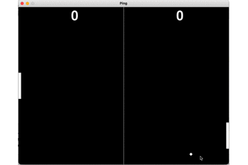

# pygame-ping - simple ball game with python and pygame

I made a simple game with python and pygame

A classic table tennis game

<br><br><br><br><br><br><br><br><br><br><br><br><br><br>

## From pygame to the browser

You can convert a python pygame into an webassembly and play it in the browser.

Install pygbag https://github.com/pygame-web/pygbag


```Rust
pip install pygbag
```

You have to rename your game to main.py and make its loop async aware.


```Rust
import pygame, asyncio

FRAMES_PER_SECOND = 30


class Ping:
...

    async def game_loop(self):
        while True:
            for event in pygame.event.get():
                if (event.type == pygame.KEYDOWN and event.key == pygame.K_ESCAPE) \
                        or (event.type == pygame.QUIT):
                    return

            self.update()
            self.draw()
            await asyncio.sleep(0)

...

async def main():
    ping = Ping()
    await ping.game_loop()

asyncio.run(main())
```

Compile to webassembly


```Rust
pygbag ./folder
```

You can play it.
Chrome should work. Use keyboard.

https://hebi-python-ninja.itch.io/ping-from-pygame-to-the-web


```Rust

```
